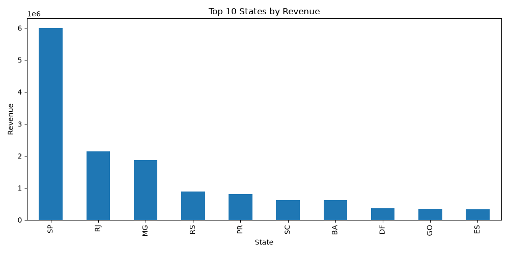
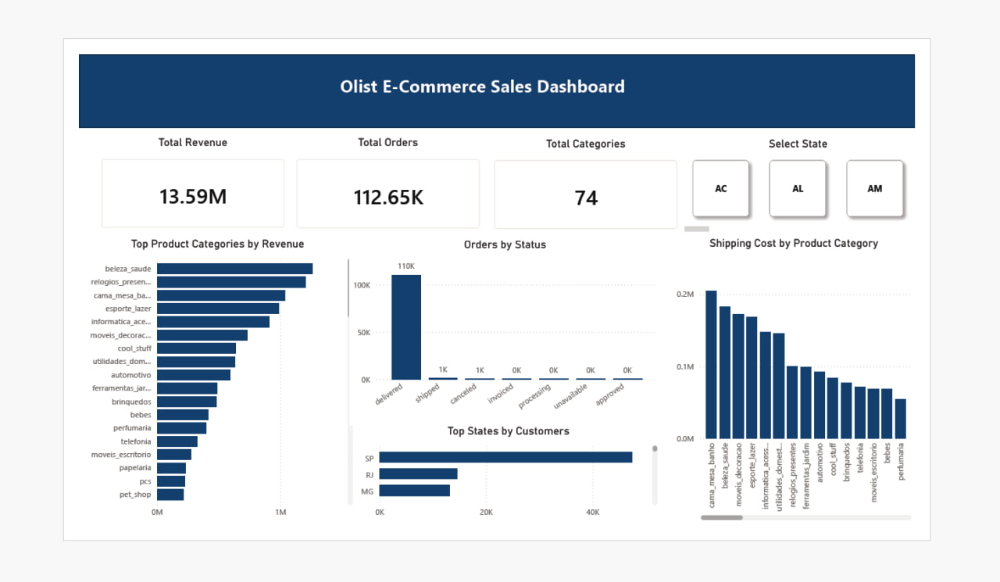

# Olist Customer Segmentation Analysis

This project analyzes customer purchasing behavior using the Olist Brazilian E-Commerce Dataset.

## Objectives

- Identify high-value customers
- Analyze customer spending patterns
- Explore revenue distribution across Brazilian states
- Create visualizations using Python

## Technologies

- Python
- Pandas
- Matplotlib
- CSV Data Analysis

## Dataset

Brazilian E-Commerce Public Dataset by Olist

## Visualization

## Power BI Dashboard

The dashboard was built using Power BI Desktop based on the Olist Brazilian E-Commerce Dataset.

Key metrics:
- Total Revenue: 13.59M
- Total Orders: 112.65K
- Product Category Analysis
- State Performance Analysis
- Order Status Analysis
## Power BI Dashboard

📄 Download Dashboard PDF:

[Olist Power BI Dashboard](Olista_esd.pdf)
